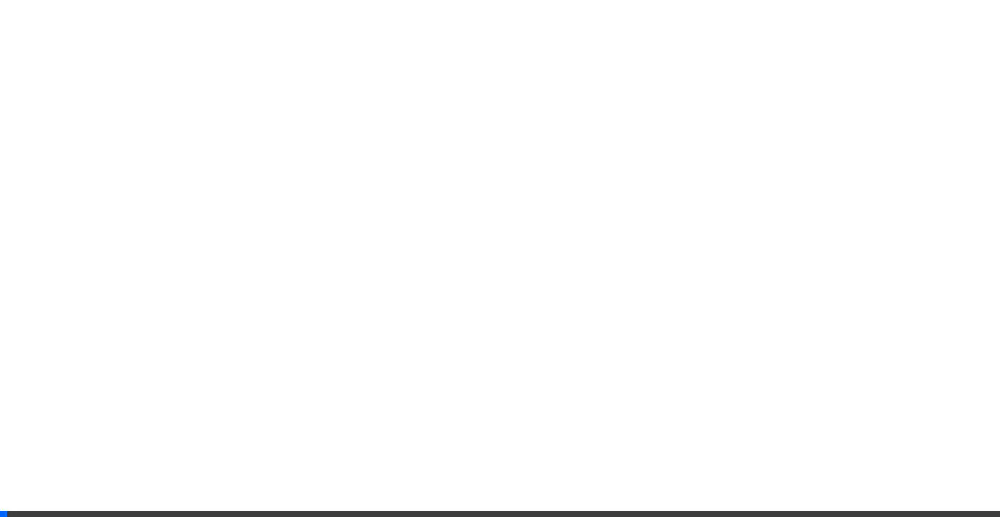
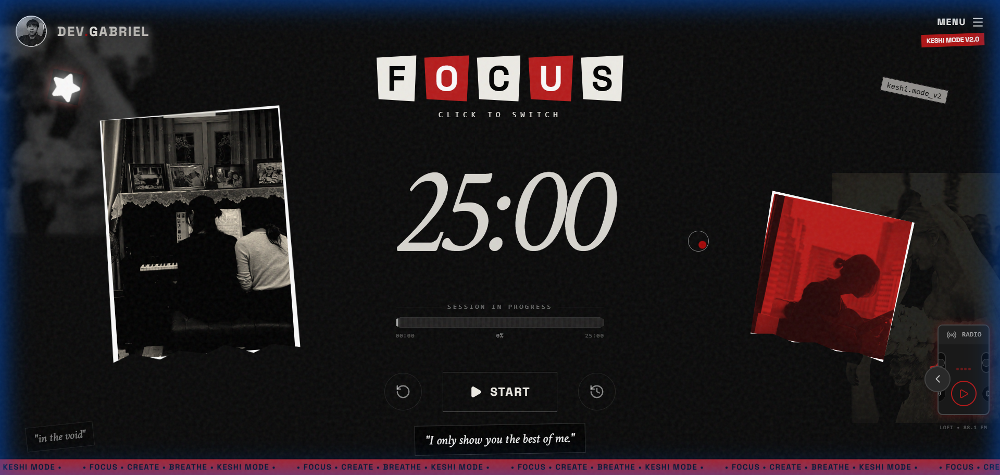
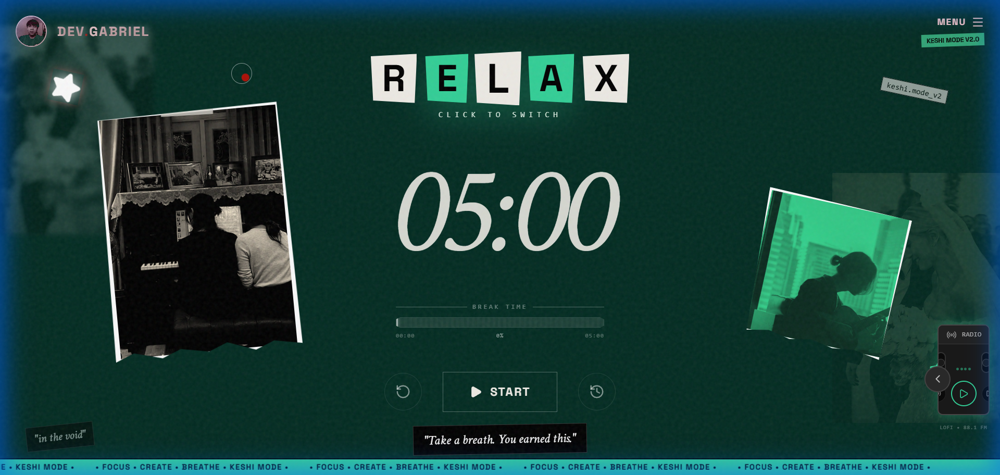

<p align="center">
  
</p>

<h1 align="center">🍅 Keshi Pomodoro</h1>

<p align="center">
  <strong>"I couldn't find a timer that felt like <em>me</em>, so I built one."</strong>
</p>

<p align="center">
  This isn't just another productivity tool. It's a digital space carved out of frustration with sterile, lifeless apps. 
  Born from a need to escape the noise and find a rhythm that feels less like "work" and more like "creation."
  <br><br>
  Heavily inspired by <strong>Keshi's</strong> lo-fi aesthetic—where every imperfection is intentional, and the vibe matters more than the metrics.
</p>

<p align="center">
  <a href="https://keshi-pomodoro.vercel.app/">
    
  </a>
</p>

<p align="center">
  
  
  
  
  
</p>

---

## ✨ The Vibe (Demos)

### 🍅 Just Flow
No distractions. Just you, the timer, and the mood. A seamless switch between grinding and breathing.

<p align="center">
  
</p>

### 🎨 Your Space, Your Rules
Because the default settings never feel right. Tweak the colors until it hits that specific feeling you're looking for.

<p align="center">
  
</p>

### ⚙️ Behind the Scenes
Fine-tune the rhythm. Check your stats not for productivity scores, but to see how much of yourself you put into the work.

<p align="center">
  
</p>

---

## 🎨 Crafted Details (Features)

### 🎭 Mood Switching
Work hard, burn out? No. We switch modes.
**Focus** is deep, intense, red. **Relax** is calm, healing, green. The transition isn't just a color swap; it's a mental shift.

<table>
  <tr>
    <td align="center"><strong>🔴 The Grind (Focus)</strong></td>
    <td align="center"><strong>🟢 The Breath (Relax)</strong></td>
  </tr>
  <tr>
    <td></td>
    <td></td>
  </tr>
</table>

---

### 🎬 Entrance as an Experience
Startups load fast; Art arrives.
I didn't want elements to just "appear." I wanted them to *enter*.
Every button, every letter, every pixel slides in with a cinematic delay because the start of a session should feel like the opening credits of a movie.

---

### 🖼️ Digital Nostalgia
Why does software have to look like software?
I brought in the things I love from the physical world:
- **Floating Polaroids**: Memories drifting in the void.
- **Ransom Notes**: Because perfection is boring.
- **Tape & Texture**: It feels handmade because in a way, it is.

---

### 📻 The Soundtrack
Silence is loud. The built-in radio isn't a feature; it's a necessity.
Cassette tape visuals + curated Lofi streams = The only way I can focus.

---

### 🎯 The Essentials
Underneath the aesthetic, it still does the job.
- **Custom Timers**: Set it to your own rhythm.
- **History**: Proof that you showed up today.
- **Sound**: Subtle cues, not jarring alarms.
- **Shortcuts**: Keep your hands on the keyboard, keep the flow.

---

## 🛠️ Tech Stack

- **Framework:** React 19 + TypeScript
- **Build Tool:** Vite 7
- **Styling:** TailwindCSS 3.4
- **Animations:** Framer Motion
- **Icons:** Lucide React
- **Deployment:** Vercel

---

## 🚀 Getting Started

```bash
# Clone the repository
git clone https://github.com/yourusername/pomodoro-keshi.git

# Navigate to project
cd pomodoro-keshi

# Install dependencies
npm install

# Start development server
npm run dev

# Build for production
npm run build
```

---

## 📁 Project Structure

```
src/
├── components/
│   ├── Background.tsx    # Collage images & decorative elements
│   ├── CustomCursor.tsx  # Custom cursor with trail effect
│   ├── Modals.tsx        # Settings & History modals
│   ├── RadioWidget.tsx   # Lo-fi music player
│   └── TimerRing.tsx     # SVG progress ring
├── utils/
│   └── animations.ts     # Framer Motion variants & delays
├── App.tsx               # Main application component
└── index.css             # Global styles & custom classes
```

---

## 🎨 Design Philosophy

Inspired by:
- **Keshi's aesthetic** — Dreamy, nostalgic, lo-fi vibes
- **Vision boards** — Magazine clippings, polaroids, tape
- **Ransom notes** — Cut-out letter typography
- **Analog textures** — Grain overlay, paper cream tones

---

## 📝 License

MIT © 2024

---

<p align="center">
  <strong>Made with 🍅 and ☕</strong>
</p>

<p align="center">
  <em>"I only show you the best of me."</em>
</p>
