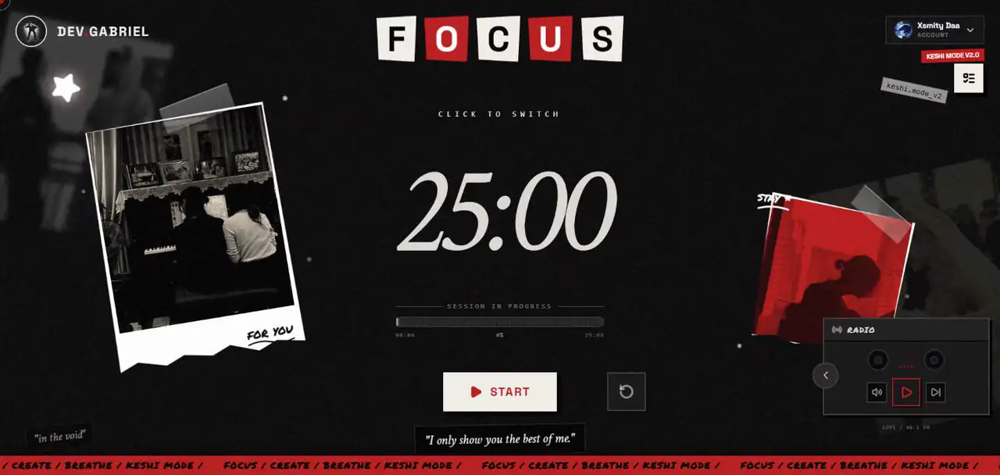
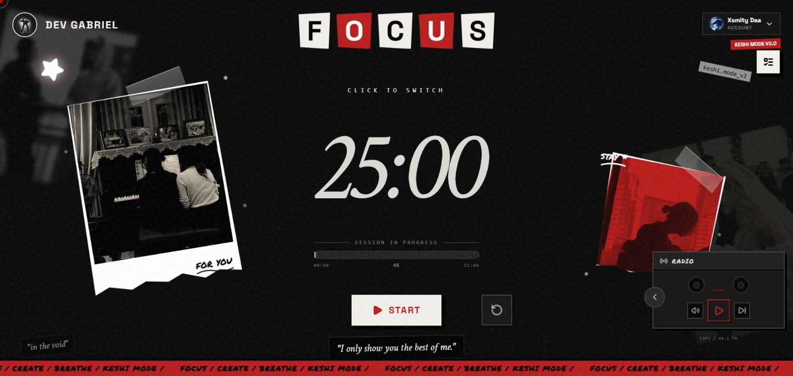
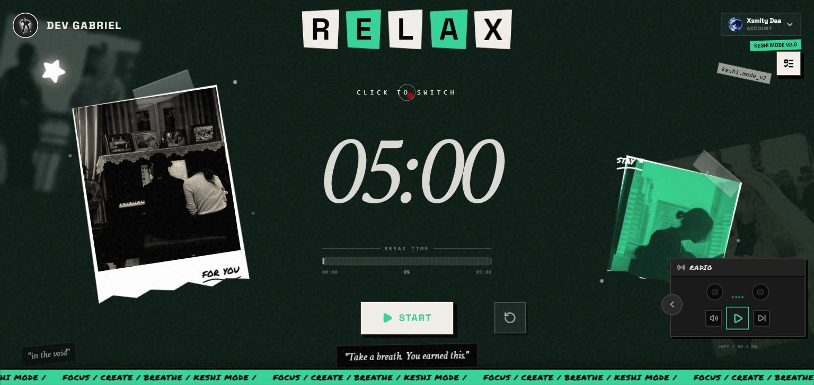
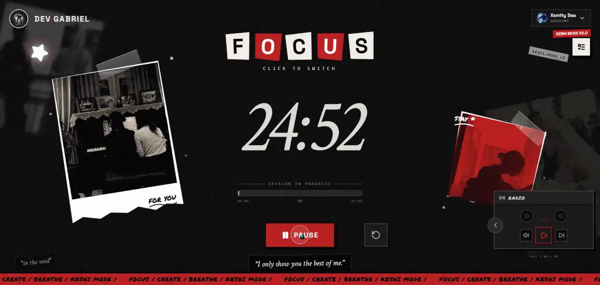
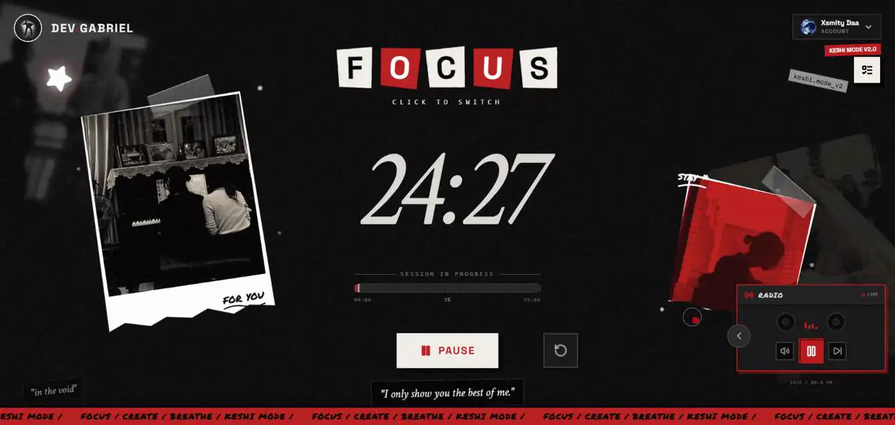
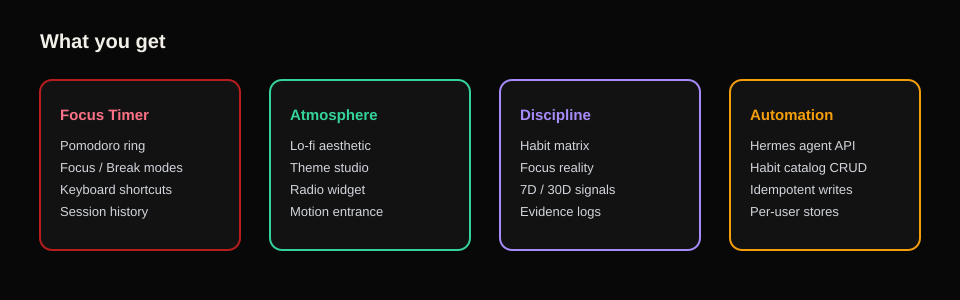
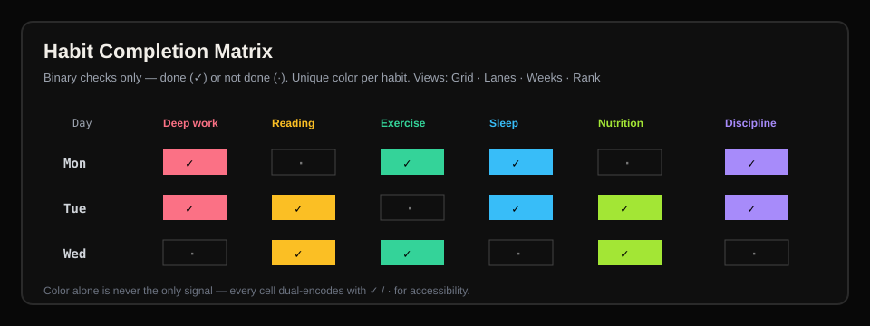
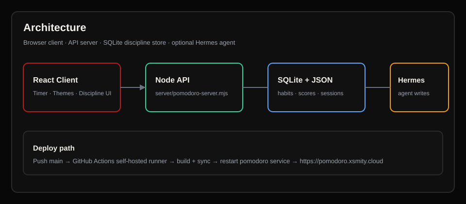

<p align="center">
  
</p>

<h1 align="center">Keshi Pomodoro</h1>

<p align="center">
  <strong>A lo-fi focus timer with a real Discipline dashboard — built for people who care about rhythm, not empty productivity theater.</strong>
</p>

<p align="center">
  Aesthetic Pomodoro client · binary habit tracking · focus reality analytics · agent-friendly API
</p>

<p align="center">
  <a href="https://pomodoro.xsmity.cloud/"></a>
  <a href="https://github.com/Xsmitylnwza/keshi-pomodoro"></a>
  
</p>

<p align="center">
  
  
  
  
  
  
</p>

---

## Why this exists

Most Pomodoro apps are either:

1. sterile stopwatches with charts nobody rereads, or  
2. aesthetic shells that forget the actual tracking loop.

**Keshi Pomodoro** sits in the middle:

- a timer that *feels* intentional (Keshi / scrapbook / lo-fi UI)
- a **Discipline** surface that shows whether you actually showed up
- an API that humans *and* agents (Hermes) can write into safely

> Not a coach. Not a guilt machine. A **pattern mirror** for focus, habits, and load.

---

## Live product at a glance

### Timer experience

<p align="center">
  
</p>

Focus mode hits deep red. Break mode cools into green. The transition is a mental shift, not a theme toggle.

<table>
  <tr>
    <td align="center" width="50%"><strong>Focus mode</strong></td>
    <td align="center" width="50%"><strong>Break / relax mode</strong></td>
  </tr>
  <tr>
    <td></td>
    <td></td>
  </tr>
</table>

### Theme studio

<p align="center">
  
</p>

### Settings & history chrome

<p align="center">
  
</p>

---

## Feature map

<p align="center">
  
</p>

| Pillar | What you get |
| --- | --- |
| **Focus timer** | Pomodoro ring, focus/break modes, keyboard shortcuts, session history |
| **Atmosphere** | Lo-fi scrapbook UI, theme studio, radio widget, motion entrance |
| **Discipline** | Habit matrix, focus reality, 7D/30D range, readiness signals, evidence logs |
| **Automation** | Per-user habit catalog API, binary scores, Hermes-ready idempotent writes |

---

## Discipline dashboard (the differentiator)

Most timers stop at “minutes completed.” Discipline answers:

- Did each habit get done today — yes or no?
- Which habits are rising or softening across 7 / 30 days?
- When did deep focus actually happen hour-by-hour?
- What evidence supports that day (sessions, reading, exercise, notes)?

### Habit model (binary, not vibes scoring)

| Value | Meaning |
| --- | --- |
| `0` | not done |
| `1` | done |

Legacy scores `1–10` map as **any value > 0 → done**.  
Day total = `habits done / active habit count`.

<p align="center">
  
</p>

### Habit matrix views

| View | Best for |
| --- | --- |
| **Grid** | Compare habits across days (default on 7D desktop) |
| **Lanes** | Streak reading per habit (default on 30D desktop) |
| **Weeks** | Period chunks with full-width week columns |
| **Rank** | Accessibility + mobile-friendly leaderboard |

### Focus matrix views

| View | Best for |
| --- | --- |
| **Hours** | 24h contribution timeline |
| **Days** | Intensity bars by focus minutes |
| **Rank** | Highest-focus days in the window |

### Shared page chrome

- **7D / 30D** range is page-global  
- selected day is page-global  
- matrix view mode is **per-matrix** (remembered in `localStorage`)  
- click a day → select it and open **Evidence**  
- unique color + Lucide icon per habit  
- dual encoding: color **and** `✓` / `·` (not color-only)

### Language rules (product philosophy)

| Use | Avoid |
| --- | --- |
| Pattern mirror | Coach / assistant |
| Quiet decision support | “Do this next” commands |
| Readiness signal | Recovery prescriptions |
| Habit completion | Quality grades 0–10 as primary UX |

---

## Architecture

<p align="center">
  
</p>

```text
Browser (Vite/React)
   │  REST
   ▼
Node API  (server/pomodoro-server.mjs)
   │
   ├─ JSON stores for timer/tasks/history
   └─ SQLite habit_definitions + discipline scores/logs
            ▲
            │ agent gateway (optional)
         Hermes / automation
```

**Production**

- App: `https://pomodoro.xsmity.cloud`  
- API: `https://pomodoro.xsmity.cloud/api`  
- Agent gateway: `https://xsmity.cloud/api/agent/pomodoro`

---

## Quick start

### Requirements

- Node.js 20+ recommended  
- npm 10+

### Install & run (local)

```bash
git clone https://github.com/Xsmitylnwza/keshi-pomodoro.git
cd keshi-pomodoro

npm install

# optional: seed local mock tasks / history / discipline data
npm run seed:local

# API + frontend together (local mock auth enabled in Vite DEV)
npm run dev:all
```

Or split processes:

```bash
npm run api   # Node API
npm run dev   # Vite client
```

### Common scripts

| Script | Purpose |
| --- | --- |
| `npm run dev:all` | Local full stack |
| `npm run seed:local` | Seed mock data |
| `npm run seed:local:force` | Reseed mock data |
| `npm run build` | Typecheck + production build |
| `npm test` | API contract tests |
| `npm run lint` | ESLint |
| `npm run preview` | Preview production build |

---

## Project structure

```text
pomodoro-keshi/
├── public/                 # static assets + recorded demos
│   └── demo/               # main_page / theme / menu demos
├── assets/                 # focus/relax stills
├── docs/
│   ├── readme/             # diagrams used in this README
│   ├── hermes-discipline-log-guide.md
│   └── ...
├── server/
│   └── pomodoro-server.mjs # API + discipline storage
├── src/
│   ├── components/
│   │   ├── DisciplineDashboard.tsx
│   │   ├── TimerRing.tsx
│   │   ├── RadioWidget.tsx
│   │   ├── ThemeSettings.tsx
│   │   └── ...
│   ├── lib/
│   │   ├── disciplineApi.ts
│   │   ├── disciplineDashboardModel.ts
│   │   └── ...
│   ├── context/            # auth + theme
│   └── App.tsx
├── tests/                  # Node test runner + Playwright demos
├── CONTEXT.md              # product language + current discipline model
└── DESIGN_SYSTEM.md        # visual system tokens
```

---

## Discipline API (human + Hermes)

Base (local): `http://localhost:<api-port>/api`  
Base (prod): `https://pomodoro.xsmity.cloud/api`

### Habit catalog (per user)

```http
GET    /api/discipline/habits
POST   /api/discipline/habits
PATCH  /api/discipline/habits/:key
DELETE /api/discipline/habits/:key
```

Create example:

```json
{
  "label": "No social media",
  "icon": "phone",
  "color": "fuchsia"
}
```

### Daily review & scores

```http
GET  /api/discipline/review?date=YYYY-MM-DD
POST /api/discipline/scores
```

Scores accept active habit keys as `0 | 1` (legacy `1–10` still maps to done when `> 0`).

### Date + timezone rules

- Dates are `YYYY-MM-DD`
- Business timezone: **Asia/Bangkok**
- Agents should send the explicit business date (don’t guess server local time)

### Idempotency

For automation writes, send:

```http
Idempotency-Key: hermes:<job>:<date>:<stable-item-id>
```

Full agent cookbook: [`docs/hermes-discipline-log-guide.md`](docs/hermes-discipline-log-guide.md)

---

## Design system (short)

Dark OLED void · paper cream text · accent red (focus) · accent green (break/ok).

| Token | Value | Use |
| --- | --- | --- |
| `bg-dark` | `#080808` | canvas |
| `paper-cream` | `#f2efe9` | primary text / paper |
| `accent-red` | `#b91c1c` | focus / primary action |
| `accent-green` | `#34d399` | break / success / signal |

Typography: **Space Grotesk** (UI) · **Crimson Text** (quotes) · **Permanent Marker** (scrap accents).  
Full tokens: [`DESIGN_SYSTEM.md`](DESIGN_SYSTEM.md)

---

## Responsive & accessibility notes

Built to work across **~375 / 768 / 1024 / 1440**:

- sticky page chrome with horizontal scroll on small screens  
- touch-sized targets (~44px) on mobile controls  
- matrix view switcher expands full-width on phone  
- habit/focus tables use a single overflow host + sticky day labels  
- smart defaults: mobile → Rank, 7D → Grid/Hours, 30D → Lanes/Days  
- dual-encoded habit cells (`✓`/`·` + color)  
- `prefers-reduced-motion` respected for Framer + spinners  

---

## Testing

```bash
# API contract tests (Node built-in test runner)
npm test

# optional: Playwright demo recording config lives in
# playwright.config.ts + tests/record_demos.spec.ts
```

---

## Deploy

Push to `main`. GitHub Actions on the self-hosted runner labeled `pomodoro` builds and restarts the `pomodoro` service.

Workflow: [`.github/workflows/deploy.yml`](.github/workflows/deploy.yml)

---

## Roadmap ideas (community-friendly)

- [ ] Exportable weekly discipline report (PNG/PDF)
- [ ] Public demo fixtures without auth friction
- [ ] More matrix encodings (pattern fill for colorblind)
- [ ] Plugin hooks for third-party agent writers
- [ ] Optional multi-language UI strings (EN first)

---

## Contributing

1. Fork & branch from `main`
2. Keep UI copy in **English ASCII** for shared surfaces
3. Discipline language stays **non-coaching** (see `CONTEXT.md`)
4. Prefer small, reviewable PRs with screenshots for UI changes
5. Run `npm test` and `npm run build` before opening a PR

### Good first issues

- improve empty states
- add habit icons to the catalog palette
- document more Hermes job recipes
- accessibility passes on matrix keyboard navigation

---

## Related docs

| Doc | Contents |
| --- | --- |
| [`CONTEXT.md`](CONTEXT.md) | current product language + habit model |
| [`DESIGN_SYSTEM.md`](DESIGN_SYSTEM.md) | colors, type, texture patterns |
| [`docs/hermes-discipline-log-guide.md`](docs/hermes-discipline-log-guide.md) | agent write flows |
| [`docs/discipline-dashboard-implementation-plan.md`](docs/discipline-dashboard-implementation-plan.md) | dashboard build history |

---

## License

MIT © 2024–2026 Xsmity / contributors

---

<p align="center">
  <strong>Made for deep work that still feels human.</strong><br />
  <em>Show up. Check the box. Read the pattern. Adjust yourself — not the scoreboard.</em>
</p>
